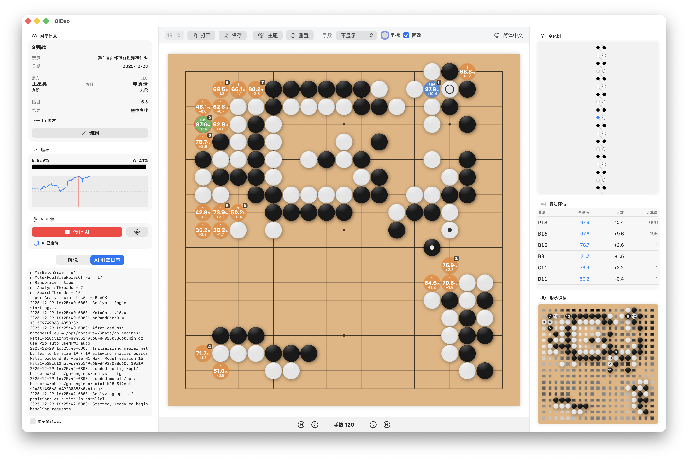

# QiDao 棋道

*A modern Go game front end for macOS*

**QiDao 棋道** 是专为 macOS 设计的现代化围棋工具，提供强大易用的棋谱分析、编辑和练习功能。QiDao 旨在利用 macOS 原生技术栈（SwiftUI）和高性能 Rust 核心，为棋友提供优雅流畅且功能强大的围棋研究体验。

## 前置要求

- **硬件**：搭载 Apple Silicon (M1, M2, M3, M4 等) 芯片的 Mac。
- **操作系统**：macOS 14.0 Sonoma 或更高版本。
- **AI 引擎**：目前仅支持 KataGo 引擎。
  - 本软件不内置 KataGo 引擎，您需要从 [KataGo 主页](https://github.com/lightvector/KataGo) 自行下载二进制文件、权重模型 *model* 及配置文件，或使用 [Homebrew](https://brew.sh/) 安装（`brew install katago`）。

## 核心功能

- **棋盘与对局管理**：
  - 支持 19x19、13x13、9x9 多种棋盘尺寸。
  - 内置“木质”与“黑白印刷”两种精美棋盘主题。
  - 支持标准 SGF 文件的加载与保存，支持查看和编辑基本信息和注释。
  - 高性能渲染的图形化棋谱变化树，支持分支删除。
- **AI 实时分析**：
  - 集成 KataGo Analysis API，提供毫秒级的实时分析反馈。
  - **胜率走势图**：实时追踪对局胜率变化，自动识别失误着法 *blunder* 并在胜率图中标记。
  - **AI 选点提示**：在棋盘上直接显示 AI 推荐的选点、胜率及后续变化（鼠标悬停显示），并在 **着法评估** 表格中实时更新详细数据。
  - **形势评估**：通过 **领地图** *ownership map* 直观展示双方控制区域。

## 主要亮点

- **原生体验**：完全基于 SwiftUI 开发，完美契合 macOS 系统风格，支持原生快捷键和流畅的动画。
- **极致性能**：核心逻辑（SGF 解析、规则、AI 引擎通信等）由 Rust 编写，确保在高强度 AI 分析下依然保持流畅界面响应。
- **现代化 UI**：简洁、直观的三栏式布局，信息展示清晰而不拥挤。

## 安装与配置

1. 从 [Releases](https://github.com/neolee/qidao/releases) 区域下载最新的 `.dmg` 文件并安装。
2. 首次启动后，点击侧边栏 AI 引擎区域的“齿轮”图标进入设置。
3. 在 **引擎方案 Engine Profiles** 中编辑默认方案：
   - **名称 Name**: 自定义方案名称。
   - **引擎路径 Path**: 选择您的 KataGo 二进制文件路径。
   - **权重路径 Model**: 选择您的 `.bin.gz` 权重文件路径。
   - **配置文件路径 Config**: 选择您的 `.cfg` 配置文件路径（注意：请选择 `analysis.cfg` 文件而非 `gtp.cfg`）。
4. 点击 **保存 Save** 保存配置，然后点击“启动 AI”即可开始分析。

## 未来计划

- **编辑模式**: 支持自由摆子，可在棋盘上添加三角、圆圈、字母等标记，可导出 SGF。
- **练习模式**: 支持与 AI 进行人机对战，自定义让子与贴目。
- **跨平台**：原生 Windows 版本开发。

## 感谢

感谢所有为开源围棋软件和 AI 引擎做出贡献的开发者们，特别是：
- [KataGo](https://github.com/lightvector/KataGo)：最强大的开源围棋 AI 引擎。
- [LizzieYzy](https://github.com/yzyray/lizzieyzy)：优秀的围棋 GUI，启发了 QiDao 的设计理念，特别是在 AI 分析展示方面。

p.s. 某种意义上，正是因为 LizzieYzy 不再维护才有了本项目。在现代化的 AI 编程助手帮助下，希望本项目能持续迭代改进，成为围棋爱好者的首选工具。